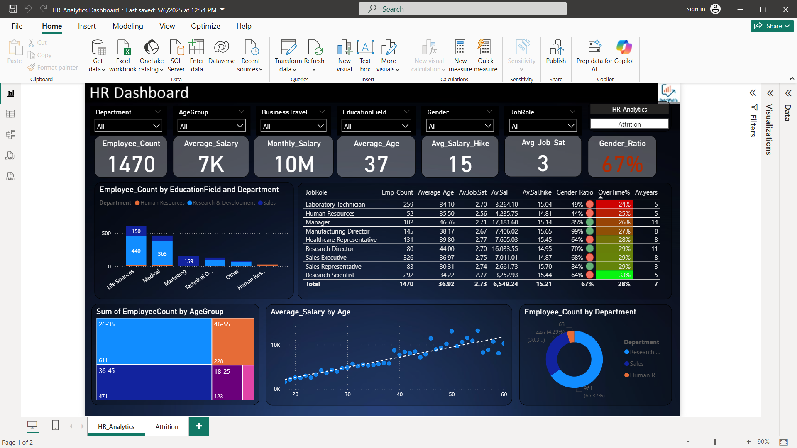
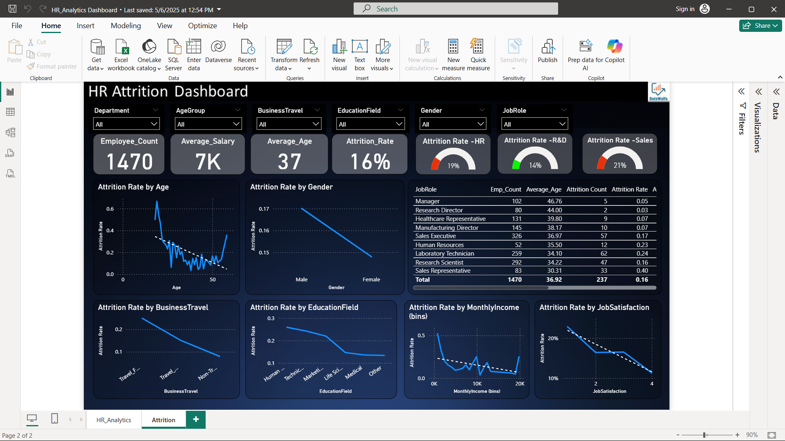

# 👥 HR Analytics Dashboard

## 📖 Project Overview
This project focuses on analyzing employee data to understand workforce trends such as attrition, performance, and employee distribution across departments. The dashboard provides meaningful insights to support HR decision-making and improve employee retention strategies.

---

## 🎯 Objectives
- Analyze employee attrition patterns  
- Monitor workforce distribution across departments  
- Identify factors affecting employee performance  
- Support data-driven HR decisions  

---

## 🛠️ Tools & Technologies
- Power BI (Dashboard & Visualization)  
- MS Excel (Data Cleaning & Preparation)  

---

## 📊 Key Features
- Interactive dashboard with filters and slicers  
- Attrition analysis (department-wise, role-wise)  
- Employee performance tracking  
- Visual representation using charts and KPIs  
- Drill-down analysis for deeper insights  

---

## 📷 Dashboard Preview

### Attrition Analysis

---

## 🔍 Data Processing Steps
1. Collected employee dataset  
2. Cleaned and preprocessed data using Excel  
3. Performed data transformation  
4. Loaded data into Power BI  
5. Built data model and relationships  
6. Designed interactive dashboard  

---

## 📈 Insights & Findings
- Identified departments with high attrition rates  
- Analyzed patterns affecting employee retention  
- Observed workforce distribution trends  
- Highlighted key factors influencing performance  

---

## 🚀 How to Use
1. Download the `.pbix` file from this repository  
2. Open using Power BI Desktop  
3. Use filters and visuals to explore insights  

---

## 💡 Future Improvements
- Predictive analysis for employee attrition  
- Integration with real-time HR systems  

---

## 👩‍💻 Author
**G. Abhi Rami**  
📧 gundrathiabhirami03@gmail.com  
